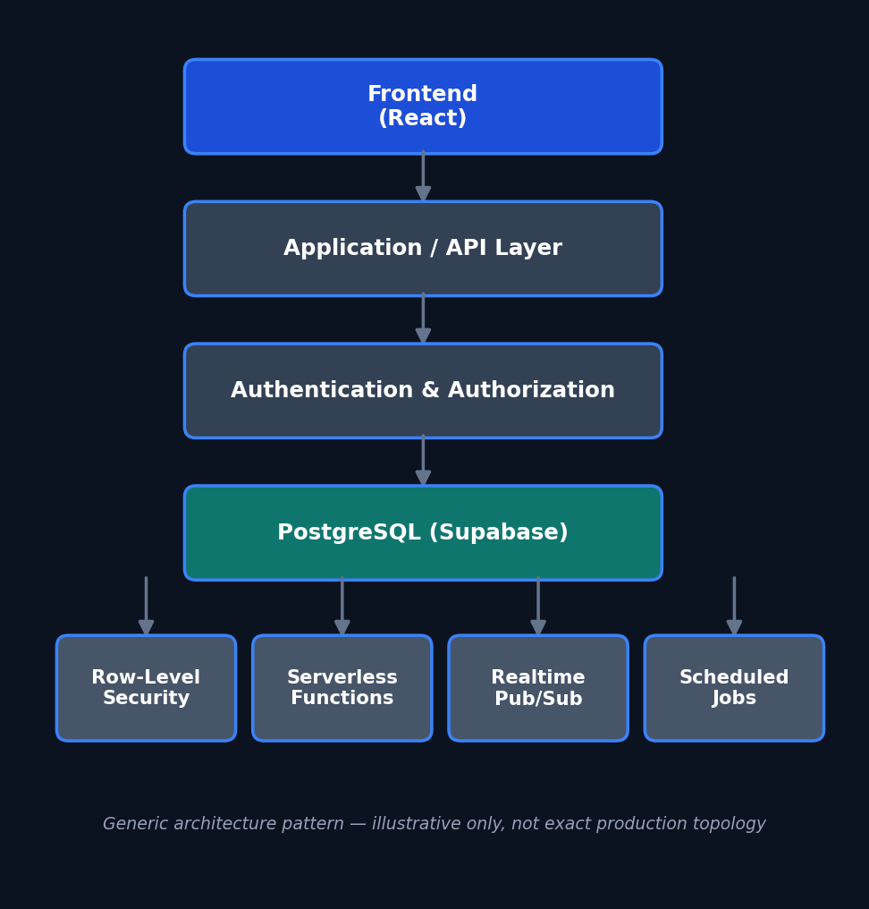

# AtlasFlow

A production multi-tenant SaaS platform for NYC DHS-regulated shelter operations — built, shipped, and operated solo.

**Live product:** [atlasflow.pro](https://atlasflow.pro)

> **About this repository.** AtlasFlow's production source code is private — it runs a real DHS-regulated shelter operator's operations and handles real organizational data, so the implementation isn't open for confidentiality reasons. This repository documents the system's architecture and engineering decisions at a level of detail that demonstrates the work without exposing proprietary implementation, credentials, or any client/resident information. Diagrams and descriptions below use generic labels rather than exact production topology.

---

## Overview

NYC DHS-regulated shelter operators must track client presence, unit occupancy, and compliance documentation to a strict standard. Before AtlasFlow, that was handled with a physical sign-in logbook, whiteboards, and spreadsheets maintained independently by intake, operations, and social services staff — which produced data mismatches, manual counting errors, and no single source of truth or audit trail.

AtlasFlow replaces that with one system: real-time presence and occupancy tracking, a compliance inspection engine, automated case-note generation, and access scoped by role across every staff tier. It was designed, built, and deployed solo for one DHS-regulated shelter operator and architected to extend to additional NYC social service agencies.

## Engineering Highlights

- **Multi-tenant SaaS architecture** with organization-scoped data isolation enforced at the database layer, not just in application code
- **PostgreSQL database design**: a 20-table schema supporting the full operational workflow (presence, occupancy, inspections, case notes, audit logs)
- **Row-Level Security**: 63 RLS policies enforcing tenant isolation and role-based access across 5 permission tiers (super admin, org admin, director, case manager, ops staff)
- **Role-based access control**, enforced by the database rather than trusted to the UI alone
- **Serverless functions**: 6 edge functions handling authentication, scheduled processing, and backend logic without a standing server
- **Real-time pub/sub**: live occupancy and presence updates pushed to every connected client instantly, so departments see one shared state instead of reconciling separate records
- **Scheduled jobs**: automated data retention and 48-hour absence alerting
- **Authentication & authorization**: HMAC-signed badge authentication for kiosk check-in, layered with role-scoped authorization for staff accounts
- **Security operations**: rotated all credentials and re-verified RLS and auth configuration after a hosting-provider security incident
- **Workflow automation**: a compliance inspection engine (weighted scoring, cross-shift discrepancy detection, approve/reject workflow) and automated case-note generation, cutting staff documentation time by 70%
- **Operational discipline**: dev/prod environment separation, branch protection on the main branch, isolated per-environment configuration

## Architecture

This is a generic representation of the pattern, not the exact production topology, internal endpoints, or service names. Full description in [`docs/architecture.md`](docs/architecture.md).

## Database & Access Control

Multi-tenant isolation is enforced with PostgreSQL Row-Level Security rather than relying on application-layer checks alone — every query is automatically scoped to the requesting user's organization and role by the database itself. Five permission tiers (super admin → ops staff) map to a defined set of allowed operations per tier, and every access-affecting action is captured in an audit trail.

Concept-level explanation only — actual policy definitions, table names, and schema details are not published. Full write-up in [`docs/database-design.md`](docs/database-design.md).

## Security

Security was treated as a first-class design constraint, not an afterthought:
- Authorization enforced at the database layer (RLS) as the primary control, not just the UI
- Signed-token authentication for kiosk hardware, rather than trusting device identity alone
- Credentials rotated and RLS/auth configuration re-verified after a hosting-provider security incident
- Environment separation (isolated dev/prod projects and credentials) so testing never touches production data

No secrets, signing keys, tokens, internal endpoints, or bypass logic are described here or anywhere in this repository. Full write-up in [`docs/security-overview.md`](docs/security-overview.md).

## Impact

- Live in production at one shelter operator with 5 active staff users; rollout to additional staff underway
- Reduced staff documentation time by 70% through automation
- Supports daily operations for a facility serving 32+ families
- ~13,000 lines of code, 140+ commits, 25+ pages, solo-built and solo-operated

## Screenshots

Screenshots are intentionally not yet included — see `docs/security-overview.md` for the exact sanitization checklist each one has to pass first (dummy data only, no real names/addresses/case content, no working QR codes, no internal URLs). Planned additions, once sanitized: the live occupancy board, the QR kiosk check-in screen, the compliance inspection form, and the role-scoped admin view, all captured from a seeded demo environment rather than production.

## Discuss This Project

Happy to walk through the RLS design, the real-time architecture, or a live demo in an interview.
[LinkedIn](https://linkedin.com/in/khizar-kamrankz) · [Email](mailto:khizarkamran9@gmail.com)
